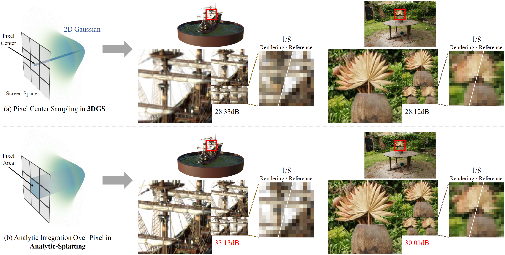

# Analytic-Splatting: Anti-Aliased 3D Gaussian Splatting via Analytic Integration

#####  
 [Zhihao Liang](https://lzhnb.github.io/), [Qi Zhang](https://qzhang-cv.github.io/), [Wenbo Hu](https://wbhu.github.io/), [Lei Zhu](https://rayleizhu.github.io/), [Ying Feng](https://scholar.google.com.hk/citations?user=PhkrqioAAAAJ&hl=zh-CN), [Kui Jia](http://kuijia.site/)

#### 
[Project Page](https://lzhnb.github.io/project-pages/analytic-splatting) | [ArXiv](https://arxiv.org/abs/2403.11056) | [Paper](https://arxiv.org/pdf/2403.11056.pdf)

  

We present Analytic-Splatting that improve the pixel shading in 3DGS to achieve anti-aliasing by analytically approximating the pixel area integral response of Gaussian signals.

 

 

 

 All Code will be released soon... 🏗️ 🚧 🔨

