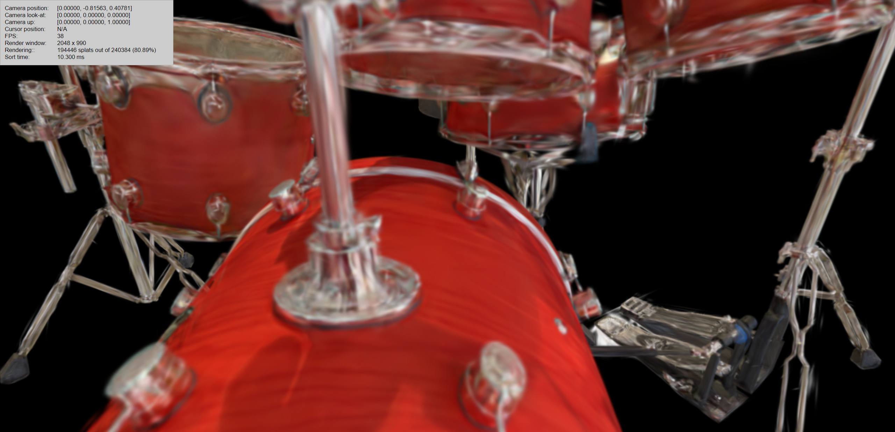
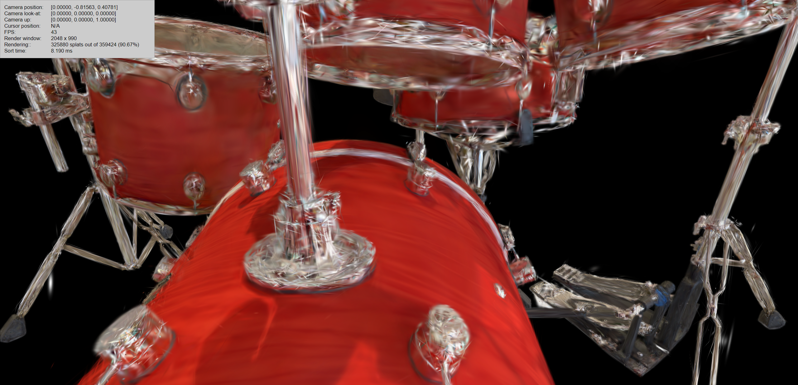

# <p align="center"> Analytic-Splatting: Anti-Aliased 3D Gaussian Splatting via Analytic Integration (ECCV 2024) </p>

#####  <p align="center"> [Zhihao Liang](https://lzhnb.github.io/), [Qi Zhang](https://qzhang-cv.github.io/), [Wenbo Hu](https://wbhu.github.io/), [Lei Zhu](https://rayleizhu.github.io/), [Ying Feng](https://scholar.google.com.hk/citations?user=PhkrqioAAAAJ&hl=zh-CN), [Kui Jia](http://kuijia.site/)</p>

#### <p align="center">[Project Page](https://lzhnb.github.io/project-pages/analytic-splatting) | [ArXiv](https://arxiv.org/abs/2403.11056) | [Paper](https://arxiv.org/pdf/2403.11056.pdf) | [Online Viewer](https://lzhnb.github.io/project-pages/analytic-splatting-demo/)</p>

## Introduction
We present Analytic-Splatting that improves the pixel shading in 3DGS to achieve anti-aliasing by analytically approximating the pixel area integral response of Gaussian signals.
<p align="center">
  
</p>
<br>

<div align="center">
 
</div>
<br>

<!-- <p align="center"> All Code will be released soon... 🏗️ 🚧 🔨</p> -->
<p align="center"> Welcome to the Online Viewer to view the results of Analytic-Splatting.</p>

## Installation
Clone the repository and create an anaconda environment using
```sh
git clone https://github.com/lzhnb/Analytic-Splatting
cd Analytic-Splatting

conda create -y -n ana-splatting python=3.8
conda activate ana-splatting

pip install torch==1.12.1+cu113 torchvision==0.13.1+cu113 -f https://download.pytorch.org/whl/torch_stable.html
conda install cudatoolkit-dev=11.3 -c conda-forge

pip install -r requirements.txt

pip install submodules/diff-gaussian-rasterization
pip install submodules/simple-knn/
```


## Dataset

#### Blender Dataset
Please download and unzip `nerf_synthetic.zip` from the [NeRF official Google Drive](https://drive.google.com/drive/folders/128yBriW1IG_3NJ5Rp7APSTZsJqdJdfc1).
Please run the follow script and get the multi-scale version:
```sh
python convert_blender_data.py \
--blenderdir dataset/nerf_synthetic \
--outdir dataset/nerf_synthetic_multi
```

#### Mip-NeRF 360 and Tanks&Temples + Deep Blending
The MipNeRF360 scenes are hosted by the paper authors [here](https://jonbarron.info/mipnerf360/).
You can find our SfM data sets for Tanks&Temples and Deep Blending [here](https://repo-sam.inria.fr/fungraph/3d-gaussian-splatting/datasets/input/tandt_db.zip).


## Running
We evaluate our method on [NeRF-Synthetic](https://drive.google.com/drive/folders/128yBriW1IG_3NJ5Rp7APSTZsJqdJdfc1) and [Mip-NeRF 360](https://jonbarron.info/mipnerf360/) datasets.

**Please note that we use `-i images_4/images_2` instead of `-r 4/2` for single-scale training on Mip-NeRF 360 dataset, which will lead to artificially high metrics!!!**

### Blender Synthetic
Take the `lego` case as an example.
**Multi-Scale Training and Evaluation**
```sh
python train.py \
-m outputs/chair-ms/ \
-s dataset/nerf_data/nerf_synthetic_multi/chair/ \
--white_background \
--eval \
--load_allres \
--sample_more_highres
```
> Set `--filter3d` to enable 3D filtering proposed in Mip-Splatting;
> Set `--dense` to enable densification proposed in GOF.

```sh
python render.py -m outputs/chair-ms/ --skip_train --lpips
```
> set `--vis` to save testing results.

**Single-Scale Training and Evaluation**
```sh
python train.py \
-m outputs/chair/ \
-s dataset/nerf_data/nerf_synthetic/chair/ \
--white_background \
--eval
```
> Set `--filter3d` to enable 3D filtering proposed in Mip-Splatting;
> Set `--dense` to enable densification proposed in GOF.

```sh
python render.py -m outputs/chair/ --skip_train --lpips
```
> Set `--vis` to save testing results.

### Mip-NeRF 360
Take the `bicycle` case as an example.
**Multi-Scale Training and Evaluation**
```sh
python train_ms.py \
-m outputs/bicycle-ms \
-s dataset/nerf_data/nerf_real_360/bicycle/ \
-i images_4 \
--eval \
--sample_more_highres
```

```sh
python render_ms.py -m outputs/bicycle-ms/ --skip_train --lpips
```

**Single-Scale Training and Evaluation**
```sh
python train.py \
-m outputs/bicycle/ \
-s dataset/nerf_data/nerf_real_360/bicycle/ \
-i images_4 \
--eval
```

```sh
python render.py -m outputs/bicycle/ --skip_train --lpips
```

For convenience, you can run the corresponding script in `scripts` to get the result of the corresponding setting.

## Detailed Reulsts
Please refer to our supplmentary and my [Google Sheet](https://docs.google.com/spreadsheets/d/15cnGqvbwyPBKa8FcbLhV3qE06sT6yyECohV8Bgnhg-E/edit?usp=sharing) for more comparison details.
> We also report the results under the **Mip-Splatting**'s *STMT setting* (`360STMT-PSNR↑-r`, `360STMT-SSIM↑-r`, and `360STMT-LPIPS↑-r`). And the results show that **3D filtering** is very useful for the *STMT-MipNeRF 360*.
> 

## Online Viewer
Following Mip-Splatting, we also support the online viewer for real-time viewing.
After training, the exported `point_cloud.ply` can be loaded in [our online viewer](https://lzhnb.github.io/project-pages/analytic-splatting-demo/) for visualization.
For better visualization, we recommand setting `--filter3d` during training to enable 3D filtering. *3D filtering proposed in Mip-Splatting is a great way to eliminate aliasing that appears at extreme zooming in.*
Here is a comparison of extreme zooming in with (left) and without (right) 3D filtering.
<div align="center">
 
</div>
<br>

```sh
python create_fused_ply.py -m ${model_path} --output_ply fused/{scene}_fused.ply"
```

## Acknowledge
- [gaussian-splatting](https://github.com/graphdeco-inria/gaussian-splatting)
- [Mip-Splatting](https://github.com/autonomousvision/mip-splatting)
- [GOF](https://github.com/autonomousvision/gaussian-opacity-fields)

## Citation
If you find this work useful in your research, please cite:
```txt
@article{liang2024analytic,
  title={Analytic-Splatting: Anti-Aliased 3D Gaussian Splatting via Analytic Integration},
  author={Liang, Zhihao and Zhang, Qi and Hu, Wenbo and Feng, Ying and Zhu, Lei and Jia, Kui},
  journal={arXiv preprint arXiv:2403.11056},
  year={2024}
}
```
